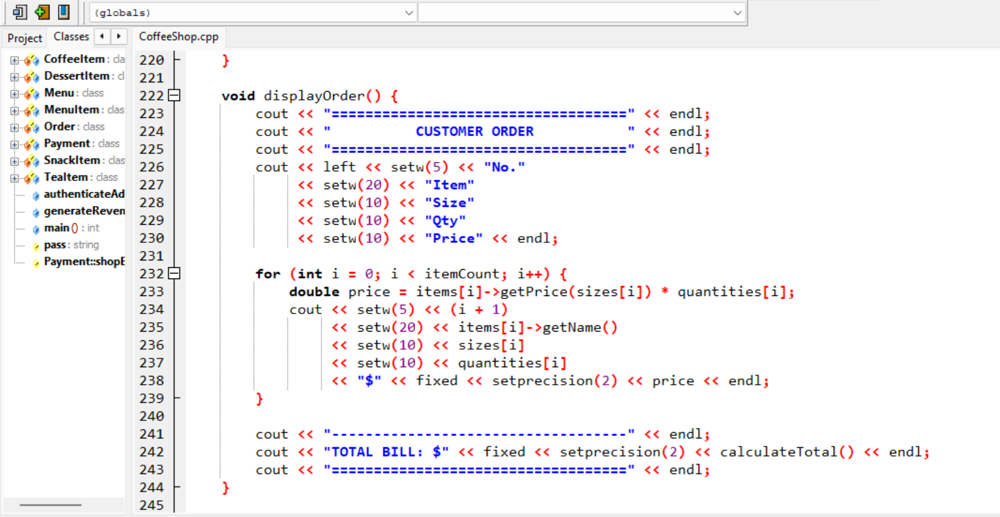
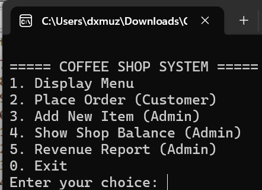
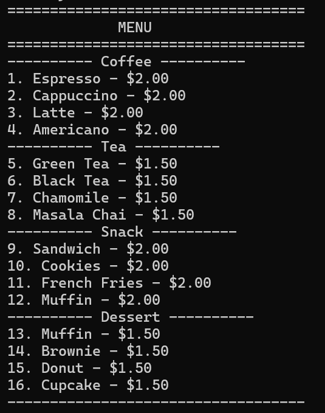

# C++ Coffee Shop Management System

A complete **C++ console-based project** implementing **object-oriented programming**, **file handling**, and **real-world business logic**.
This project is ideal for students searching for **C++ projects**, **C++ OOP projects**, and **C++ file handling examples**.

## Description

This project is a **console-based Coffee Shop Management System** developed in **C++** using **object-oriented programming principles**.
It simulates real-world coffee shop operations such as **menu management**, **customer ordering**, **billing**, **payment processing**, and **revenue tracking**.

The system supports **both customer and admin roles**, utilizes **file handling for persistent data storage**, and is designed to run efficiently on **Windows, Linux, and Ubuntu** environments.

## Features

* Object-Oriented Design using inheritance and polymorphism
* Dynamic menu management with categories
* Order placement with size and quantity options
* Automatic bill generation
* Cash and card payment simulation
* Persistent shop balance using file handling
* Order history storage
* Admin authentication
* Revenue report generation

## Technologies Used

* C++ Programming Language
* Object-Oriented Programming (OOP)
* File Handling (`fstream`)
* Standard Template Library (STL)
* Console-based Interface

## Screenshots

### Code Structure

  

### Program Output 1

  

### Program Output 2

  

## How to Run

1. Clone or download the repository
2. Open terminal in the project directory
3. Compile and run using **Dev-C++** or any standard **C++ compiler**

## Author

**ALI HUSNAIN**

